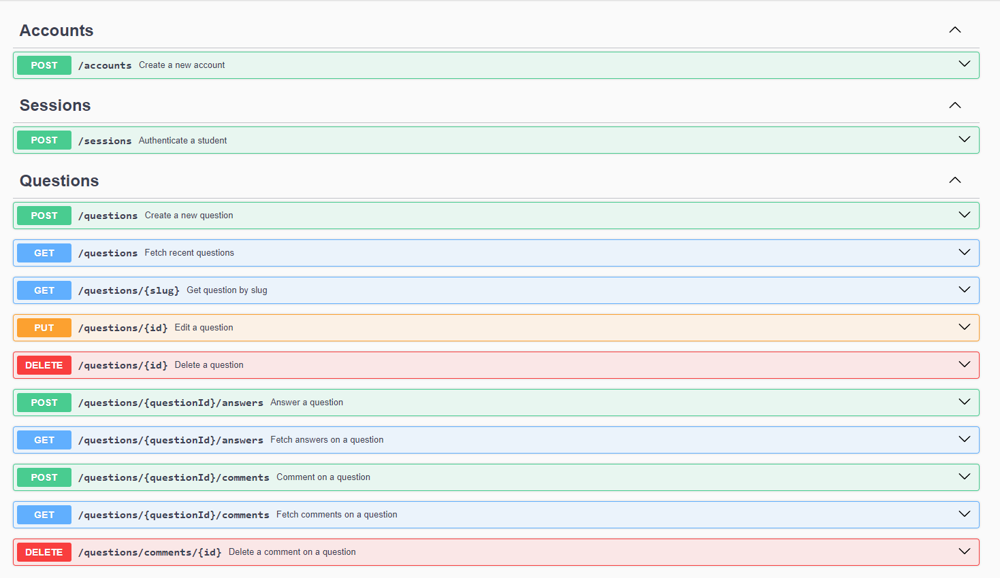
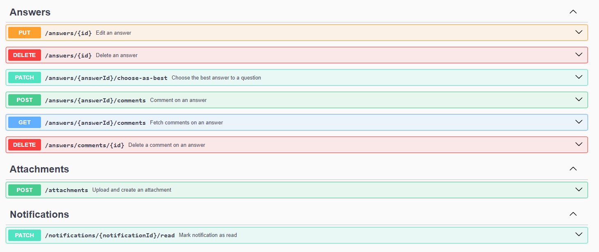
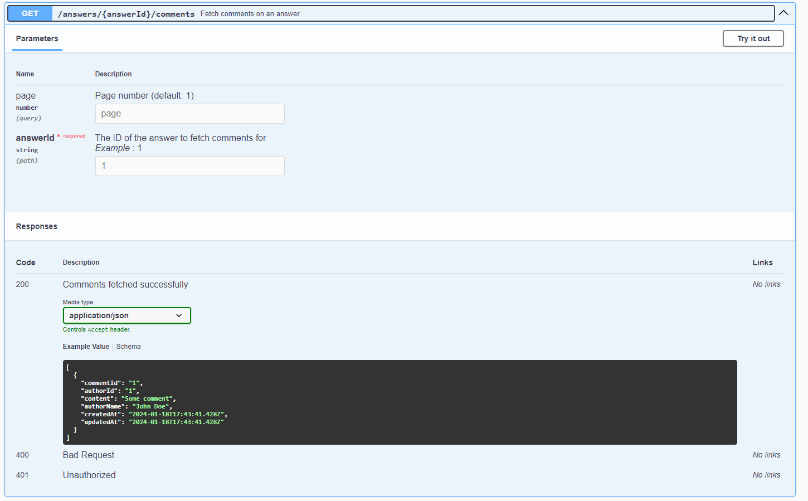
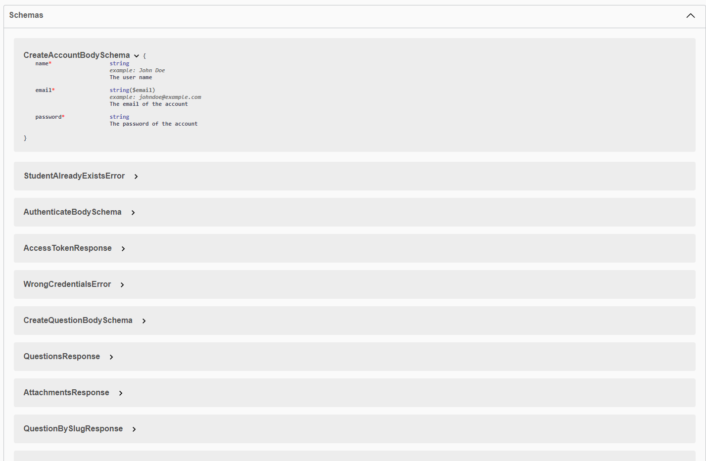

# Forum API
## [BR]

Esta API foi desenvolvida para simular o funcionamento de um fórum, onde é possível criar uma conta, se autenticar, fazer uma pergunta, responder uma pergunta, comentar em uma pergunta ou resposta, anexar arquivos, dentre outros.

A documentação foi feita utilizando Swagger, no final do texto encontra-se algumas imagens da documentação.

## [EN]

This API was developed to simulate the functioning of a forum, where it's possible to create an account, authenticate, ask a question, respond to a question, comment on a question or answer, attach files, among other features.

The documentation was created using Swagger, and some images of the documentation can be found at the end of the text.

